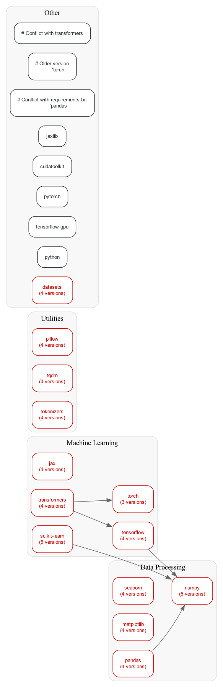

# Python Dependency Analyzer

A powerful Rust-based tool for analyzing Python project dependencies, detecting potential conflicts, and visualizing dependency relationships. This tool helps you understand and manage complex dependency trees in Python projects.

## ✨ Features

- 📦 **Multi-Format Support**: Scans and analyzes multiple dependency file formats:
  - `requirements.txt`
  - `setup.py`
  - `Pipfile`
  - `pyproject.toml`
  - `environment.yml`

- 🔍 **Advanced Conflict Detection**:
  - Version requirement conflicts
  - Known package incompatibilities
  - Detailed conflict reports with suggestions
  - Smart version resolution hints

- 📊 **Rich Visualization**:
  - Text-based dependency lists
  - GraphViz DOT format output
  - PNG visualization with package grouping
  - Color-coded conflict highlighting

- 🛡️ **Dependency Analysis**:
  - Package relationship mapping
  - Version compatibility checking
  - Dependency tree visualization
  - Circular dependency detection

## 🎯 Example Output

Here's an example of the dependency graph generated by the tool:



The graph shows:
- 🔴 **Red nodes**: Version conflicts detected
- 🟠 **Orange nodes**: Known package conflicts
- ⚫ **Gray nodes**: Normal dependencies
- 📦 **Grouped packages**: Related packages are clustered together
- 〰️ **Dashed edges**: Conflict relationships

## 🚀 Installation

1. **Prerequisites**:
   - Rust toolchain (install from [rustup.rs](https://rustup.rs))
   - GraphViz (for graph visualization):
     ```bash
     # macOS
     brew install graphviz
     
     # Ubuntu/Debian
     sudo apt-get install graphviz
     
     # Windows
     choco install graphviz
     ```

2. **Build and Install**:
   ```bash
   # Clone the repository
   git clone https://github.com/yourusername/dependency-analyzer.git
   cd dependency-analyzer

   # Build the project
   cargo build --release

   # Optional: Add to your PATH
   cp target/release/dependency-analyzer ~/.local/bin/
   ```

## 💻 Usage

### Basic Usage

```bash
# Analyze a Python project with default settings
dependency-analyzer --path /path/to/python/project

# Generate a visual dependency graph
dependency-analyzer --path /path/to/python/project --format png --output deps.png

# Get detailed text output
dependency-analyzer --path /path/to/python/project --format text
```

### Output Formats

1. **Text Format** (`--format text`):
   ```
   numpy (>=1.19.2) [from requirements.txt]
   └── pandas (>=1.2.0) [from setup.py]
       └── scikit-learn (>=0.24.0) [from Pipfile]
   ```

2. **DOT Format** (`--format dot`):
   - Generates a GraphViz DOT file
   - Can be converted to various image formats
   - Includes detailed dependency information

3. **PNG Format** (`--format png`):
   - Creates a visual dependency graph
   - Color-coded nodes for conflicts
   - Grouped related packages
   - Clear relationship visualization

## 🔧 How It Works

The tool follows this workflow to analyze dependencies:


1. **Scanning**: 
   - Recursively searches for dependency files
   - Supports multiple file formats
   - Handles nested project structures

2. **Parsing**:
   - Extracts package requirements
   - Parses version specifications
   - Validates syntax and formats

3. **Analysis**:
   - Checks version compatibility
   - Identifies known conflicts
   - Maps package relationships
   - Detects circular dependencies

4. **Visualization**:
   - Generates dependency graph
   - Groups related packages
   - Highlights conflicts
   - Creates visual output

## 🤝 Contributing

Contributions are welcome! Here's how you can help:

1. Fork the repository
2. Create a feature branch (`git checkout -b feature/amazing-feature`)
3. Commit your changes (`git commit -m 'Add amazing feature'`)
4. Push to the branch (`git push origin feature/amazing-feature`)
5. Open a Pull Request

## 📝 License

This project is licensed under the MIT License - see the [LICENSE](LICENSE) file for details.

## 🙏 Acknowledgments

- [Graphviz](https://graphviz.org/) for graph visualization
- [petgraph](https://github.com/petgraph/petgraph) for graph algorithms
- [clap](https://github.com/clap-rs/clap) for CLI argument parsing
